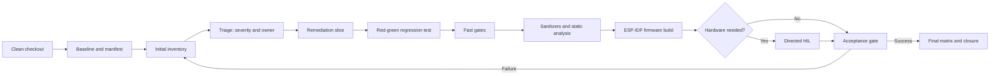
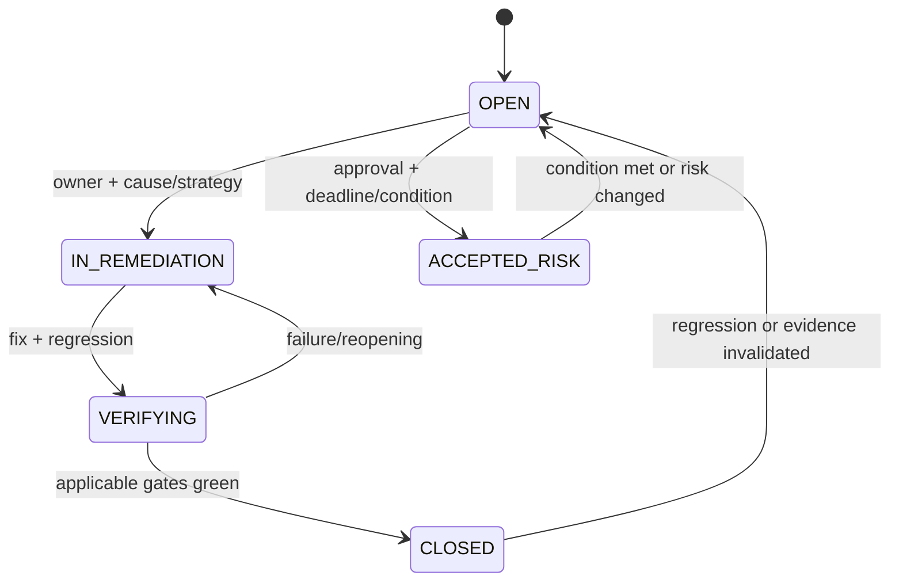
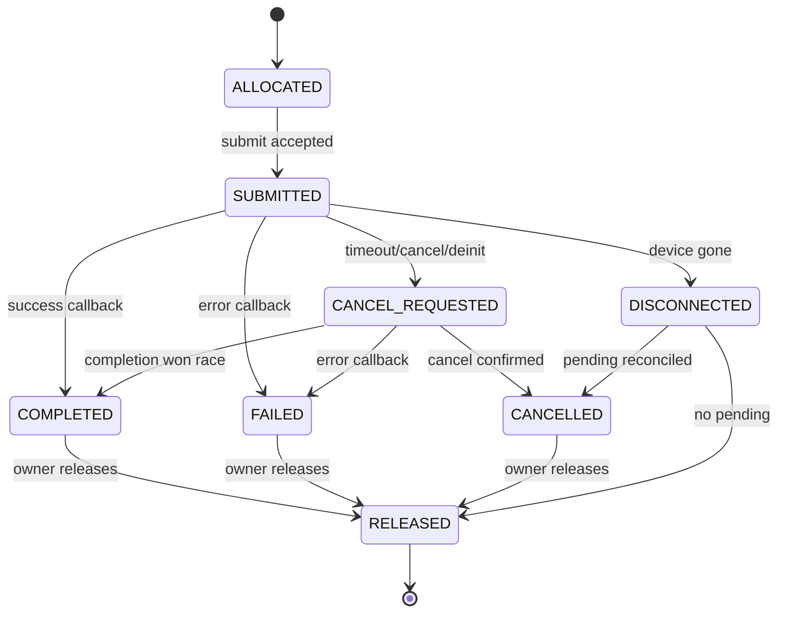
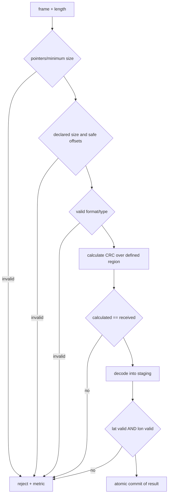
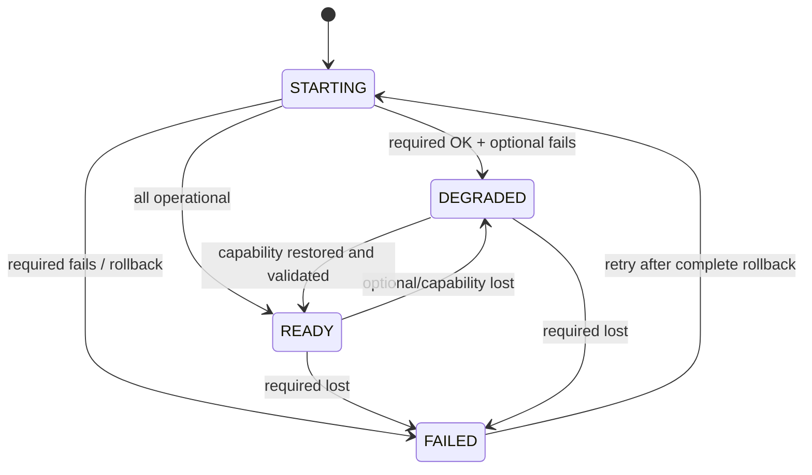
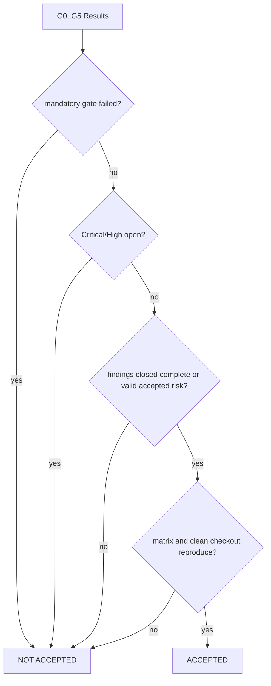

# Design Document — Quality Review and Remediation

## Overview

This design defines how to audit, prioritize, remediate, and prevent quality regressions in the ESP32-S3 firmware and host tests. The focus is to transform each problem into a reproducible finding, with explicit ownership, incremental correction, regression test, and CI gate. The document does not prescribe a product rewrite: it introduces minimal, verifiable contracts around the highest-risk areas.

The repository remains compatible with ESP-IDF v5.3, CMake, CTest, Unity, and Theft. C interfaces below are proposed contracts; names may be adjusted during implementation, as long as semantics, ownership, and properties are preserved. Orchestration algorithms are described in Structured Pseudocode to avoid premature coupling to specific scripts.

### Objectives

- Produce a clean and repeatable baseline for firmware, host tests, and static analysis.
- Maintain a versioned inventory that connects evidence, cause, remediation, test, and acceptance.
- Apply progressive gates, with fail-closed for Critical/High risks and new regressions.
- Make bounds, ownership, concurrency, lifecycle, and readiness explicit.
- Remediate in small slices, each with a red-green test or equivalent proof.
- Separate test doubles from objects linked to the production firmware.
- Enable diagnosis of drops, protocol rejections, and initialization failures.

### Non-goals

- Implement production fixes in this phase.
- Redesign detection, UI, telemetry, or spectral analysis features unrelated to a finding.
- Replace ESP-IDF, FreeRTOS, CMake, Unity, or Theft.
- Promise formal proof of absence of all failures; gates combine tests, sanitizers, static analysis, and, when necessary, HIL.
- Execute real USB/SPI drivers in host tests; these paths use deterministic doubles and subsequent firmware/HIL validation.

### Context decisions

The audit starts from the observed state: `test/host/CMakeLists.txt` references `components/hal` despite `components/hw_hal` existing; the README cites absent artifacts and `run_tests`; the current CI only runs `idf.py build`; there are placeholders in source lists; queues lack segmented metrics; `Ready` is displayed without result aggregation; Spectrum Analyzer accepts non-operational states; SDR uses USB address `1` and fixed delays; NRF24 publishes 32 bytes; RemoteID does not compare the received CRC and accepts coordinate pairs with logical OR.

## Architecture

### Audit Process Architecture



### Gates and promotion policy

| Gate | Input | Verification | Required output | Blocks when |
|---|---|---|---|---|
| G0 Baseline | clean checkout | environment, commands, exit code, duration, logs | `baseline.yaml` and evidence | command does not reproduce or uses local state |
| G1 Inventory | known/new findings | schema, IDs, evidence and severity | valid `findings.yaml` | required item missing or invalid |
| G2 Host fast | remediation change | configure/build/CTest, Unity and Theft | machine-readable result | build/test fails or unauthorized skip |
| G3 Security | affected units | sanitizers, warnings and static analysis | normalized report | blocking diagnostic or new warning |
| G4 Firmware | clean tree | canonical ESP-IDF v5.3 commands | binary, map and log | configuration/build/link fails |
| G5 Conditional HIL | hardware/timing-dependent change | USB/SPI/ISR/reconnection scenarios | device report and logs | contract not demonstrable on host or HIL fails |
| G6 Acceptance | all artifacts | matrix, Critical/High, gates, docs | reproducible decision | any mandatory gate fails or Critical/High open |

G2 and G3 should fail early; G4 does not replace host tests. G5 is mandatory only for behavior that doubles cannot validate, such as electrical integration, real enumeration, USB stack callbacks, physical SPI arbitration, and ISR context. Every gate calls the same canonical command used locally; workflows only orchestrate these commands.

### Audit algorithm

```text
ALGORITHM ReviewAndRemediate(commit)
PRECONDITION checkout is clean AND tool versions are declared
1. Capture environment and execute every canonical command in a fresh build directory.
2. For each observed failure or risk:
   a. Create or update exactly one finding with stable ID and immutable baseline commit.
   b. Record current file:line evidence, reproduction, impact, probability and owner.
   c. Classify severity; Critical/High immediately blocks acceptance.
3. Order open findings by dependency, then severity, then remediation risk.
4. For each remediation slice:
   a. Add a regression test or document an equivalent proof before closure.
   b. Apply the smallest behavior change that satisfies the linked criteria.
   c. Run G2 and affected G3 checks; on failure keep finding OPEN.
   d. Run G4 and G5 when applicable.
   e. Update current evidence, results and traceability without replacing baseline evidence.
5. Evaluate G6 as a conjunction of mandatory gates and finding policy.
6. Emit final matrix; never infer acceptance from firmware build alone.
POSTCONDITION every finding is CLOSED, ACCEPTED_RISK or OPEN with explicit gate effect
```

## Data Models

### Review Artifacts

The paths below are proposed for the implementation phase and reside under `.kiro/specs/code-quality-review/artifacts/`, except for verbose logs published by CI:

| Artifact | Format | Versioned | Content |
|---|---|---:|---|
| `baseline.yaml` | YAML | yes | commit, environment, tools, commands, initial/final results |
| `findings.yaml` | YAML | yes | canonical findings inventory |
| `policy.yaml` | YAML | yes | severity, diagnostics, placeholders, skips and gates |
| `traceability.md` | Generated/validated Markdown | yes | human-readable view of the final matrix |
| `evidence/<ID>/manifest.yaml` | YAML | yes | hashes and references to logs, tests and reports |
| logs/JUnit/SARIF/map | native formats | CI artifact | verbose evidence, retained per repository policy |

External logs are referenced by job, run, name and hash; information needed for closure cannot exist solely at an ephemeral URL.

### Findings Inventory Model

```yaml
schema_version: 1
findings:
  - id: CQR-REMOTEID-001
    title: "Received CRC is not compared"
    category: parsing              # build|docs|ci|memory|parsing|concurrency|lifecycle|readiness|debt|static-analysis
    severity: High                 # Critical|High|Medium|Low
    severity_rationale:
      impact: "acceptance of non-integrity telemetry"
      probability: "untrusted external input"
    status: OPEN                   # OPEN|IN_REMEDIATION|VERIFYING|CLOSED|ACCEPTED_RISK
    owner: "services/remoteid"
    baseline:
      commit: "<sha>"
      evidence: [{location: "components/services/src/remoteid_decoder.c:<line>", excerpt_hash: "<sha256>"}]
      reproduction: ["<canonical command or test>"]
      observed_result: "<result>"
    current_evidence: [{commit: "<sha>", location: "<file:line>"}]
    root_cause: "<cause>"
    remediation: {strategy: "<strategy>", change_refs: []}
    regression:
      test_ids: []
      defective_result: "<red or equivalent proof>"
      remediated_result: "<green>"
    requirements: ["5.3", "5.4", "12.1"]
    verification: {gates: {}, artifact_refs: []}
    accepted_risk: null
```

Schema rules:

1. `id` is stable, unique, and never reused; format `CQR-<AREA>-NNN`.
2. `baseline.commit` and original evidence are immutable; `current_evidence` tracks current lines.
3. `severity_rationale` is mandatory and change history is preserved.
4. `CLOSED` requires root cause, remediation, test/proof, all applicable gates green and linked criteria.
5. `ACCEPTED_RISK` requires a named owner, justification, affected capabilities, review date/condition and approval; not permitted for Critical risk and does not turn a red gate green.
6. `OPEN`, `IN_REMEDIATION`, and `VERIFYING` are non-closed states.
7. Each skip, suppression, or intentional debt references a finding.
8. Minimum initial categories: paths/build, docs/configuration, CI, RemoteID, SDR/USB, NRF24, queues, Spectrum Analyzer, readiness/rollback, placeholders, and static analysis.



## Components and Interfaces

### Components and Affected Areas

| Area | Observed files/components | Remediation responsibility |
|---|---|---|
| Firmware build | `CMakeLists.txt`, `components/*/CMakeLists.txt`, `main/` | real sources, configuration and map without placeholders |
| Host build/tests | `test/host/CMakeLists.txt`, mocks, generators | `hw_hal` paths, CTest discovery, doubles isolation |
| CI/documentation | `.github/workflows/build-and-release.yml`, `README.md` | canonical commands, results, reference validation |
| RemoteID | `components/services/src/remoteid_decoder.c` and header | bounds, CRC, coordinates and parse-then-commit |
| Queues/pipeline | `detection_service`, `main/data_pipeline` and producers | drop policy, metrics, ownership and ISR safety |
| SDR/USB | `components/hw_hal/src/hal_sdr.c` | enumeration, completion, cancellation and reconnection |
| NRF24/SPI | `hal_nrf24`, `hw_manager`, shared HAL | actual width, RX recovery and SPI arbitration |
| Readiness | `main/main.c`, services/HAL | required/optional classification, rollback and retry |
| Spectrum | `components/services/src/spectrum_analyzer.c` | state allowlist and single ownership of SDR initialization |
| Debt/analysis | placeholders, TODO/FIXME, CI policies | product exclusion, diagnostics baseline and suppressions |

Implementation should prefer localized adaptation of existing APIs. Public changes are only accepted with simultaneous update of callers, documentation, and tests.

## Proposed Interfaces and Contracts

### Queue metrics and ownership

The default policy for telemetry/detection queues is non-blocking `DROP_NEW`: accepted items maintain FIFO; refused items remain owned by the producer. Queues that copy structs, such as the current detections queue, do not transfer heap; the contract still records that the copy was accepted or refused. Any different policy must be declared per queue and tested.

```c
typedef enum {
    QUEUE_DROP_FULL,
    QUEUE_DROP_UNAVAILABLE,
    QUEUE_DROP_CLOSED,
    QUEUE_DROP_INVALID,
    QUEUE_DROP_INTENTIONAL_SAMPLE,
    QUEUE_DROP_REASON_COUNT
} queue_drop_reason_t;

typedef enum {
    QUEUE_SUBMIT_ACCEPTED,       /* queue owns copy/ownership as configured */
    QUEUE_SUBMIT_REJECTED        /* producer retains ownership */
} queue_submit_result_t;

typedef struct {
    uint32_t queue_id;
    uint32_t source_id;
    bool from_isr;
} queue_submit_context_t;

typedef struct {
    uint64_t received;
    uint64_t enqueued;
    uint64_t processed;
    uint64_t queued;
    uint64_t dropped[QUEUE_DROP_REASON_COUNT];
} queue_metrics_snapshot_t;

queue_submit_result_t event_queue_submit(
    const void *item, size_t item_size, const queue_submit_context_t *context);
queue_submit_result_t event_queue_submit_from_isr(
    const void *item, size_t item_size, const queue_submit_context_t *context,
    bool *higher_priority_task_woken);
esp_err_t event_queue_metrics_snapshot(
    uint32_t queue_id, uint32_t source_id, queue_metrics_snapshot_t *out);
```

Contract:

- Each valid attempt increments `received` exactly once.
- Success increments `enqueued`; failure increments exactly one `dropped[reason]`.
- In a quiescent snapshot: `received = enqueued + Σdropped` and `enqueued = processed + queued`.
- Counters use supported atomics or a short critical section; snapshot uses version/seqlock or critical section to avoid combining epochs.
- ISR API does not block, does not allocate, and only uses ESP-IDF v5.3-compatible `FromISR` primitives.
- The call documents ownership: on `ACCEPTED`, queue owns copy or object; on `REJECTED`, producer frees/reuses. Consumer frees exactly once when ownership was transferred.

### Readiness and rollback

```c
typedef enum { SUBSYSTEM_REQUIRED, SUBSYSTEM_OPTIONAL } subsystem_criticality_t;
typedef enum {
    SUBSYSTEM_UNINITIALIZED,
    SUBSYSTEM_INITIALIZING,
    SUBSYSTEM_OPERATIONAL,
    SUBSYSTEM_DEGRADED,
    SUBSYSTEM_STOPPING,
    SUBSYSTEM_DISCONNECTED,
    SUBSYSTEM_ERROR
} subsystem_state_t;

typedef enum { APP_STARTING, APP_READY, APP_DEGRADED, APP_FAILED } app_readiness_t;

typedef struct {
    uint32_t subsystem_id;
    subsystem_criticality_t criticality;
    subsystem_state_t state;
    esp_err_t cause;
    uint64_t unavailable_capabilities;
    uint32_t generation;
} subsystem_result_t;

typedef struct {
    app_readiness_t state;
    uint64_t unavailable_capabilities;
    uint32_t failed_subsystem_id;
    esp_err_t cause;
} readiness_report_t;

esp_err_t app_init_run(readiness_report_t *out);
esp_err_t app_init_rollback(uint32_t generation);
readiness_report_t app_readiness_evaluate(
    const subsystem_result_t *results, size_t count);
bool subsystem_state_is_operational(subsystem_state_t state);
```

`SUBSYSTEM_OPERATIONAL` is the only generically ready state. `SUBSYSTEM_DEGRADED` only satisfies a dependency that explicitly declares it as permitted. Spectrum Analyzer requires SDR `OPERATIONAL`; `INITIALIZING`, `ERROR`, `STOPPING`, `DISCONNECTED`, `UNINITIALIZED`, and equivalent `INACTIVE` are refused. SDR initialization has a single owner; Spectrum consumes the capability, it does not reinitialize the driver.

```text
ALGORITHM InitializeWithRollback(steps)
1. generation := next_generation()
2. acquired := empty stack
3. FOR each step in dependency order:
   a. mark step INITIALIZING with generation
   b. result := step.acquire()
   c. IF result failed:
      i. mark step ERROR with cause
      ii. WHILE acquired is not empty: pop and release exactly once
      iii. invalidate every handle and task token from generation
      iv. return readiness evaluation
   d. push step.release token; mark step OPERATIONAL
4. return readiness evaluation

ALGORITHM EvaluateReadiness(results)
1. IF any REQUIRED result is not OPERATIONAL: return APP_FAILED with cause.
2. IF any OPTIONAL result is not OPERATIONAL: return APP_DEGRADED and capability mask.
3. return APP_READY.
```

### SDR/USB transfer completion and lifecycle

```c
typedef enum {
    SDR_XFER_ALLOCATED,
    SDR_XFER_SUBMITTED,
    SDR_XFER_CANCEL_REQUESTED,
    SDR_XFER_COMPLETED,
    SDR_XFER_CANCELLED,
    SDR_XFER_TIMED_OUT,
    SDR_XFER_FAILED,
    SDR_XFER_DISCONNECTED
} sdr_transfer_state_t;

typedef struct sdr_transfer sdr_transfer_t; /* opaque context, ref-counted or single owner */

typedef struct {
    sdr_transfer_state_t state;
    esp_err_t result;
    size_t actual_length;
    uint32_t device_generation;
} sdr_transfer_completion_t;

typedef void (*sdr_transfer_callback_t)(
    sdr_transfer_t *transfer,
    const sdr_transfer_completion_t *completion,
    void *user_context);

esp_err_t sdr_usb_on_device(uint8_t address, const void *descriptors);
esp_err_t sdr_transfer_submit(sdr_transfer_t *transfer,
                              sdr_transfer_callback_t callback,
                              void *user_context);
esp_err_t sdr_transfer_cancel(sdr_transfer_t *transfer);
esp_err_t sdr_transfer_wait(sdr_transfer_t *transfer,
                            uint32_t timeout_ms,
                            sdr_transfer_completion_t *out);
void sdr_transfer_release(sdr_transfer_t *transfer);
```

The address and descriptors belong to the current enumeration's generation. Transfer, buffer, and `user_context` remain valid until a reconciled terminal state. Timeout transitions to `CANCEL_REQUESTED`, requests cancellation, and waits for the terminal callback/event; it does not release prematurely. A late callback from an old generation only finalizes its context idempotently and never touches the new device.



Delays may yield CPU, but never prove completion. Deinit prevents new submits, reconciles all transfers, closes handle/device/client, and releases resources in reverse order exactly once. Reconnection creates a new generation with the enumerated address, without assuming `1`.

### SPI arbitration

The `hw_manager` is the shared bus owner. Every operation receives a generation token bound to the active module; switching between LoRa/NRF24 serializes `quiesce → release → reconfigure → acquire`. An operation with a stale token returns `ESP_ERR_INVALID_STATE` before accessing SPI. Rollback restores only a module whose release was confirmed, without concurrent bus use.

### NRF24 payload

```c
#define NRF24_PAYLOAD_MAX 32U
#define NRF24_PIPE_COUNT  6U

typedef enum { NRF24_PAYLOAD_STATIC, NRF24_PAYLOAD_DYNAMIC } nrf24_payload_mode_t;

typedef struct {
    nrf24_payload_mode_t mode;
    uint8_t static_width[NRF24_PIPE_COUNT];
} nrf24_payload_config_t;

typedef struct {
    uint8_t bytes[NRF24_PAYLOAD_MAX];
    uint8_t length;
    uint8_t pipe;
    uint8_t channel;
    uint8_t rssi_level;
    uint32_t timestamp_ms;
} nrf24_packet_t;

typedef struct {
    uint64_t invalid_width;
    uint64_t rx_recovered;
} nrf24_metrics_t;

esp_err_t hal_nrf24_receive(nrf24_packet_t *out, uint32_t timeout_ms);
esp_err_t hal_nrf24_metrics_snapshot(nrf24_metrics_t *out);
```

In dynamic mode, `R_RX_PL_WID` is queried before `R_RX_PAYLOAD`. In static mode, `static_width[pipe]` is used. Width 0, greater than 32, or incompatible with the configuration is rejected; RX is recovered per the datasheet (including flush when required), flags are reconciled, and `invalid_width` increments once. `out` is only published after complete read; bytes `[length, 32)` are zeroed to prevent accidental observability, although consumers should respect `length`.

```text
ALGORITHM ReceiveNrf24(pipe, config, staging)
1. Determine width from dynamic-width command OR configured static width for pipe.
2. IF width is outside [1, 32] OR conflicts with active mode:
   recover RX; increment invalid-width once; return invalid-size.
3. Zero staging; read exactly width bytes into staging.bytes.
4. IF SPI read fails: recover according to driver contract; return error without publishing.
5. Set staging.length := width and metadata.
6. Atomically copy staging to caller-visible output; return success.
```

### RemoteID validation and parse-then-commit

```c
typedef enum {
    RID_REJECT_NONE,
    RID_REJECT_NULL,
    RID_REJECT_TRUNCATED,
    RID_REJECT_DECLARED_LENGTH,
    RID_REJECT_BOUNDS,
    RID_REJECT_OVERFLOW,
    RID_REJECT_FORMAT,
    RID_REJECT_CRC,
    RID_REJECT_COORDINATE
} remoteid_reject_reason_t;

typedef struct {
    bool valid;
    remoteid_reject_reason_t reason;
    size_t message_offset;
    size_t message_length;
    uint8_t received_crc;
    uint8_t calculated_crc;
} remoteid_validation_result_t;

typedef struct {
    uint64_t accepted;
    uint64_t rejected[RID_REJECT_COORDINATE + 1];
    uint64_t integrity_errors;
} remoteid_metrics_t;

esp_err_t remoteid_validate_frame(const uint8_t *frame, size_t length,
                                  bool is_ble,
                                  remoteid_validation_result_t *out);
esp_err_t remoteid_decode_commit(const uint8_t *frame, size_t length,
                                 bool is_ble,
                                 decoded_telemetry_t *in_out);
esp_err_t remoteid_metrics_snapshot(remoteid_metrics_t *out);
```

The CRC region and CRC position are defined by protocol variant, not inferred from total size. Every sum uses a safe form (`required <= length - offset` after `offset <= length`). Latitude and longitude are validated separately for sentinel, scale, and intervals `[-90, 90]` and `[-180, 180]`; the pair is valid only with AND. Decoding occurs in initialized local staging; `in_out` is updated only after complete validation.



## Readiness and Acceptance Flows



Dependent operations consult the capability report, not just a UI string. `Ready` is a consequence of states, never an unconditional action. The displayed, logged, and service-exposed state derives from the same snapshot.



## Incremental Remediation Strategy

1. **Reproducible foundation:** fix only host path/command infrastructure, decide and document `sdkconfig.defaults`/`partitions.csv`, capture baseline and validate README references.
2. **Minimum gates:** add separate jobs for host configure/build/test, firmware and analysis; preserve machine-readable results; make skips visible.
3. **Safe parsing:** introduce bounds helpers, parse-then-commit, CRC and RemoteID coordinates, first with Unity/Theft and sanitizers.
4. **Observable queues:** declare policy per queue, add snapshot/segmentation and fix callers that ignore results, without changing priority/size without a specific finding.
5. **Hardware lifecycle:** stabilize doubles and SDR/USB state machine, then NRF24 and SPI arbitration; require HIL for real integration.
6. **Readiness/rollback:** make steps returnable, classify dependencies, centralize rollback, fix Spectrum and only then change UI announcement.
7. **Debt and closure:** remove placeholders from production link, validate map, zero blocking diagnostics and generate final matrix.

Each slice should be small, bisectable, and maintain build. Behavior changes for protocol, lifecycle, and infrastructure should not be combined in the same finding/commit unless there is an unavoidable documented dependency.

## Error Handling

### Error Handling and Ownership

| Resource/error | Owner | Safe state | Observability | Release |
|---|---|---|---|---|
| refused queue item | producer | item not transferred | drop by queue/source/reason | producer, once |
| accepted item | queue/consumer | FIFO preserved | enqueued/processed | consumer, once, if heap |
| parser rejects frame | caller keeps frame; parser keeps staging | previous state intact | reason and metric without over-read | staging automatic/clean |
| USB transfer | transfer context | reconciled terminal | completion/result/generation | owner after terminal, once |
| device gone | SDR HAL | new submits blocked | DISCONNECTED + cause | pending, handle, client in order |
| SPI swap fails | hw_manager | no user with invalid token | transition state/error | reverse rollback |
| partial init failure | generation orchestrator | valid APP_FAILED or DEGRADED | subsystem, cause, capability mask | reverse stack exactly once |
| invalid NRF24 width | NRF24 HAL | RX recovered, output unchanged | `invalid_width` | no payload published |
| gate/tool failure | responsible job | review not accepted | exit code, log, artifact | ephemeral workspace |

Expected errors return a specific `esp_err_t` and structured reason when needed. Logs do not substitute returns and do not access bytes beyond the received length. Cleanup is idempotent only as protection; counters/doubles must prove that physical release occurred once.

## Design Traceability Matrix

| Requirement | Design elements | Properties | Primary verification |
|---|---|---|---|
| 1 Baseline | G0, `baseline.yaml`, canonical commands | P1 | clean checkout, logs and exit codes |
| 2 Inventory | schema, rules and state machine | P2, P22 | schema/matrix validator |
| 3 Build/docs/config | foundation, reference gate | P3 | host configure + doc smoke test |
| 4 CI | G2–G4/G6 and command parity | P4, P22 | isolated jobs, CTest/JUnit |
| 5 Parsing/RemoteID | bounds, CRC, staging/commit | P5–P8 | Unity, Theft, ASan/UBSan |
| 6 Queues/concurrency | submit, snapshot, ISR and ownership | P9–P11, P21 | doubles, stress and TSan host |
| 7 SDR/USB/SPI | transfer lifecycle, generation, SPI token | P12–P14, P21 | doubles + firmware/HIL |
| 8 NRF24 | mode/width, staging and metric | P15 | SPI double + directed HIL |
| 9 Readiness | results, rollback and Spectrum allowlist | P16–P18, P21 | fault injection per step |
| 10 Placeholders | policy, map and target separation | P19 | source/symbol/map scanner |
| 11 Static analysis | G3, normalized baseline and suppressions | P20 | pinned warnings/analyzers |
| 12 Acceptance | G6, final matrix and closure rule | P21, P22 | clean end-to-end execution |

The final matrix expands this view per finding and criterion (`requirement.acceptanceCriterion`), including severity, evidence, change, test, result, and status.

## Correctness Properties

The properties below guide Theft tests, sequence-generated tests, and artifact validators. Environment properties that cannot be expressed in C are verified by fixtures and canonical command execution.

### Property 1: Self-contained and repeatable baseline

*For any* canonical command from the manifest executed twice on the same commit and declared environment, in new build directories, the command, set of versioned inputs, and success/failure classification SHALL be equivalent; each execution SHALL record commit, versions, exit code, duration, and log reference.

**Validates: Requirements 1.1, 1.2, 1.3, 1.4, 1.5, 1.6, 12.10**

### Property 2: Finding completeness and valid transitions

*For any* item in `findings.yaml`, the ID SHALL be unique and mandatory fields SHALL satisfy the schema; a transition to `CLOSED` SHALL be impossible without cause, remediation, regression/proof, criteria, and applicable gates, and a transition to `ACCEPTED_RISK` SHALL require an owner and valid future review.

**Validates: Requirements 2.1, 2.2, 2.3, 2.4, 2.5, 2.6, 10.5, 12.2, 12.8**

### Property 3: Every canonical reference resolves

*For any* command, target, script, path, or required file marked as canonical in the README/manifest, the reference SHALL exist with the same capitalization in the checkout; `sdkconfig.defaults` and `partitions.csv` SHALL satisfy exactly one policy: versioned and validated, or not referenced with effective defaults documented.

**Validates: Requirements 3.1, 3.2, 3.3, 3.4, 3.5, 3.6, 12.4, 12.5**

### Property 4: CI gate is the conjunction of mandatory checks

*For any* eligible execution, the CI result SHALL be success if and only if firmware build, host configure/build/test, and mandatory analysis succeed and there is no prohibited skip; any regression registered by CTest SHALL be discovered without a parallel manual list.

**Validates: Requirements 4.1, 4.2, 4.3, 4.4, 4.5, 4.6, 4.7, 12.3, 12.9**

### Property 5: Parser bounds safety

*For any* buffer and generated combination of declared length, offset, and field size, the parser SHALL access only the range `[0, length)`, reject non-representable sum/range, and terminate without crash, over-read, over-write, or use of uninitialized data.

**Validates: Requirements 5.1, 5.2, 5.7, 5.8**

### Property 6: Invalid CRC does not produce commit

*For any* structurally valid RemoteID frame, altering any protected bit without updating the CRC SHALL cause `RID_REJECT_CRC`, increment `integrity_errors` exactly once, and preserve byte-for-byte the previous valid state.

**Validates: Requirements 5.3, 5.4, 5.9, 12.4, 12.6**

### Property 7: Joint coordinate validity

*For any* latitude/longitude pair, `has_position` SHALL be true if and only if latitude and longitude are individually non-sentinel, correctly scaled, and within their intervals; a single invalid member SHALL invalidate the pair. The same rule applies to operator location.

**Validates: Requirements 5.5, 5.6, 5.7, 12.4**

### Property 8: Parse-then-commit preserves state

*For any* input rejected by size, format, CRC, or semantics, the public output and aircraft record SHALL remain equivalent to the previous snapshot; only allowed reason/metrics may change.

**Validates: Requirements 5.4, 5.9, 12.6**

### Property 9: Queue metrics conservation

*For any* quiescent sequence of submits, receives, and processing, each snapshot SHALL satisfy `received = enqueued + Σdropped` and `enqueued = processed + queued`, per queue and source, without torn values or counter regression.

**Validates: Requirements 6.2, 6.3, 6.4**

### Property 10: Drop and ownership exactly once

*For any* enqueue attempt, success SHALL transfer only the declared ownership and failure SHALL keep ownership with the producer; full, unavailable, or closed SHALL increment exactly one drop reason, and each heap object SHALL be freed exactly once.

**Validates: Requirements 6.1, 6.2, 6.6, 6.8**

### Property 11: Saturation recovery preserves accepted FIFO

*For any* sequence that saturates and then drains a `DROP_NEW` queue, accepted items SHALL be processed in FIFO order, rejected items SHALL appear only in metrics, and new items after drain SHALL be accepted again without consumer reinitialization.

**Validates: Requirements 6.6, 6.7**

### Property 12: SDR transfer terminates and releases once

*For any* interleaving of completion, error, timeout, cancellation, and disconnection, each submitted transfer SHALL reach exactly one reconciled terminal result and its resources SHALL be released exactly once, never before the terminal callback/event.

**Validates: Requirements 7.1, 7.4, 7.5, 7.6, 7.7, 7.8, 12.6**

### Property 13: USB generation isolates reconnections

*For any* sequence of enumeration/disconnection/reconnection with distinct addresses, submits SHALL use the address and descriptors of the current generation; a callback from an old generation SHALL NOT access the handle, context, or state of the new generation.

**Validates: Requirements 7.3, 7.6, 7.7, 7.8, 12.4**

### Property 14: SPI mutual exclusion and token validity

*For any* interleaving of LoRa/NRF24 operations and module switching, at most one owner SHALL access the shared bus; after deactivation, every stale token SHALL fail before I/O and rollback SHALL leave exactly one coherent state.

**Validates: Requirements 7.1, 7.2, 7.9**

### Property 15: NRF24 payload has exact length and no residue

*For any* sequence of valid payloads from 1 to 32 bytes, including smaller after larger, the published packet SHALL have `length` equal to the read width and prefix equal to the current payload, with no previous bytes observable; widths 0 or >32 SHALL NOT publish and SHALL increment `invalid_width` once.

**Validates: Requirements 8.1, 8.2, 8.3, 8.4, 8.5, 8.6, 8.7, 12.4**

### Property 16: Readiness derives from criticality

*For any* combination of subsystem results, `APP_READY` SHALL occur if and only if all required and main-flow dependencies are `OPERATIONAL`; safe optional failure SHALL produce `APP_DEGRADED` with capability mask, and required failure SHALL produce `APP_FAILED` and block dependents.

**Validates: Requirements 9.1, 9.2, 9.3, 9.4**

### Property 17: Rollback allows clean retry

*For any* initialization step chosen to fail after a prefix of acquisitions, rollback SHALL release the prefix in reverse order once; the following attempt SHALL use a new generation, with no invalid handles, active resources, or duplicate tasks.

**Validates: Requirements 7.2, 9.5, 9.8, 9.9, 12.6**

### Property 18: Spectrum uses operational allowlist

*For any* possible state of the SDR dependency, Spectrum Analyzer SHALL start only in the explicitly `OPERATIONAL` state; in any other state it SHALL refuse without altering its consistent state nor reinitializing the SDR.

**Validates: Requirements 9.6, 9.7, 9.8, 12.4**

### Property 19: Product does not link placeholders or doubles

*For any* production build, source lists, symbols, and map SHALL exclude prohibited placeholders and mock/fake/stub objects; test build SHALL be able to link them only in explicitly non-production targets.

**Validates: Requirements 10.1, 10.2, 10.3, 10.4, 10.6, 10.7, 12.4**

### Property 20: Diagnostics do not silently worsen

*For any* change, normalizing the analysis with the same policy/versions SHALL produce zero new blocking diagnostics; every suppression SHALL be localized and linked to a finding, and altered parsing, concurrency, ownership, or lifecycle units SHALL appear in the report.

**Validates: Requirements 11.1, 11.2, 11.3, 11.4, 11.5, 11.6, 11.7**

### Property 21: Failures preserve consistency and observability

*For any* injectable failure point in parser, enqueue, init, or transfer, the component SHALL return an observable error or corresponding metric, preserve invariants, and release only the resources it owns, without leak, double free, or use-after-free.

**Validates: Requirements 5.9, 6.1, 6.2, 6.3, 6.4, 6.5, 6.6, 7.1, 7.2, 7.3, 7.4, 7.5, 7.6, 7.7, 7.8, 7.9, 9.5, 12.6**

### Property 22: Closure and acceptance are fail-closed

*For any* set of findings and gate results, the review SHALL be `ACCEPTED` if and only if all mandatory gates are green, there are no open Critical/High, every closure has evidence/regression, and the final matrix covers each finding exactly once; otherwise it SHALL be `NOT_ACCEPTED`.

**Validates: Requirements 2.6, 12.1, 12.2, 12.3, 12.7, 12.8, 12.9, 12.10**

## Testing Strategy

### Canonical commands and isolation

The exact commands will be recorded in `baseline.yaml`; the initial contract is:

```bash
# Host: new directory, separate configuration, build and execution
cmake -S test/host -B build/host -DCMAKE_BUILD_TYPE=Debug
cmake --build build/host --parallel
ctest --test-dir build/host --output-on-failure --output-junit host-tests.xml

# Firmware ESP-IDF v5.3: environment exported by the declared image/toolchain
idf.py -B build/firmware set-target esp32s3
idf.py -B build/firmware build
```

Implementation may encapsulate these commands in versioned targets/scripts, but README, CI, and baseline must call the same entry point. The gate executes on a clean checkout, without reusing the previous `build/host` or `build/firmware`. FetchContent dependencies remain pinned to observed versions (Unity 2.6.0, Theft 0.4.5, and cJSON 1.7.18) or have changes tracked in their own finding.

### Unit tests — Unity

- Schema validators, severity, finding transitions, and acceptance decision.
- RemoteID: empty, minimum, truncated at each field, declared smaller/larger, CRC with known vectors, coordinates at boundaries/sentinels, and four validity combinations.
- Queues: success, full, unavailable, closed, source/reason, snapshot, and copy/heap ownership.
- NRF24: 1, 31, 32, 0, >32, static pipe, and larger-to-smaller sequence.
- Readiness: all operational, each required failed, each optional failed, rollback at each step, and retry.
- Spectrum: complete state table of the dependency, proving only `OPERATIONAL` passes.
- Placeholder scanner and documentation reference validation with positive/negative fixtures.

### Property-based testing — Theft

- Minimum `PBT_MIN_TRIALS=100`; raise for parsers and state machines in nightly CI without reducing the PR gate.
- Record seed and reduced counterexample; every failure must be reproducible by fixed seed.
- Generators: RemoteID buffers/lengths/offsets, coordinates, queue sequences, abstract transfer interleavings, NRF24 widths/payloads, subsystem combinations, and inventories.
- Tags: `/* Feature: code-quality-review, Property N: <name> */`.
- P5–P18 and P21 are direct PBT candidates; P1–P4, P19–P20, and P22 use validators/fixtures when they depend on filesystem or pipeline.

### Host integration with doubles

Doubles must be sequence-programmable and record calls, arguments, generation, and ownership. They reside in test-only targets and never in production `idf_component_register`.

| Double | Minimum scenarios |
|---|---|
| FreeRTOS queue/task | saturation, drain, close, ISR send, creation failure, duplicate task |
| USB host | variable address, immediate/late callback, timeout, cancel race, error, DEV_GONE, reconnect |
| SPI/NRF24 | expected commands, dynamic/static width, SPI fail, flush, and invalid tokens |
| HAL status | all states, failure per step, capability loss/recovery |
| allocator/ownership | fail-after-N, alloc/free count, poison after free |
| clock/event | virtual time; no completion inferred from sleep |

The lifecycle test explores valid event sequences; doubles reject premature `release`, callback on dead context, second free, and I/O with stale generation/token.

### Sanitizers and stress

- **ASan + UBSan (host):** parsers, NRF24 staging, queues with ownership, and lifecycle through doubles.
- **TSan (separate host job):** metrics/snapshots and concurrent abstractions compilable on host; do not combine with ASan in the same binary.
- **Leak detection:** enabled in saturation, cancellation, disconnection, and rollback tests.
- **Deterministic stress:** recorded seeds, limited count in PR, and expanded campaign scheduled.
- ESP-IDF-specific code not executable on host is covered by static analysis, boundary doubles, and build/HIL; no host sanitizer is presented as proof of the real driver.

### Static analysis and diagnostics policy

The versioned policy fixes versions and configuration of tools. The minimum set is:

- ESP-IDF and host compiler warnings, with new warning in changed code treated as error;
- C/C++ analysis on `compile_commands.json` for bounds, lifetime, uninitialized, overflow, and concurrency when supported;
- CMake validation in warning mode for uninitialized/unused variables;
- ShellCheck for shell and pinned workflow/action validator when those files are changed;
- simple custom scanner for nonexistent references, placeholders, doubles in map, and suppressions without `CQR-*`.

Results are normalized by `tool + rule + path + message fingerprint`, removing absolute paths and timestamps. The accepted baseline distinguishes backlog from regression, but Critical/High, out-of-bounds, use-after-free, double free, relevant uninitialized, relevant overflow, and data race always block. Global suppressions are prohibited; a localized suppression includes `CQR-ID`, justification, and smallest possible scope.

### Firmware build and artifact inspection

G4 uses ESP-IDF v5.3 and target `esp32s3`, in a new directory. Beyond the exit code, it preserves versions, size, map, and component list. A validator fails if it finds `domain_placeholder.c`, `hal_placeholder.c`, `services_placeholder.c`, prohibited symbols/patterns, or mock objects. The deliberate absence of functionality must result in unavailable capability/explicit error, never stub success.

### Directed HIL

HIL is not a prerequisite for every change. It becomes mandatory when the finding modifies:

- USB enumeration/reconnection and real RTL-SDR callbacks;
- timeout/cancellation whose guarantee depends on the USB stack;
- physical LoRa/NRF24 arbitration on SPI or ISR path;
- RX recovery after invalid NRF24 width;
- readiness dependent on real connection/disconnection.

The HIL matrix records hardware/firmware, cables/modules, seed/script, timestamps, result, and logs. Minimum scenarios: SDR at address other than `1`, unplug during transfer, reconnect at new address, SPI swap under traffic, and NRF24 payload of widths 1/31/32 and invalid. If hardware is not available, the finding is not closed when its criterion depends on HIL; it remains `VERIFYING` or becomes accepted risk only if permitted by policy and severity.

### CI and test artifacts

Identifiable jobs: `host-test`, `host-sanitizers`, `static-analysis`, `firmware-build`, and conditional `hil`. CTest publishes JUnit; analysis publishes appropriate machine-readable format; firmware publishes map/log. Skips are extracted from results and fail unless a temporary allowlist linked to a finding exists. Jobs do not hide failure through `continue-on-error` on mandatory gates.

### Design completion criterion

This design is ready for task decomposition when each task can point to: finding(s), exact criteria, affected contract, red-green test, applicable gates, and owner. The recommended order preserves the baseline before changing behavior and avoids declaring quality based solely on the firmware build.
