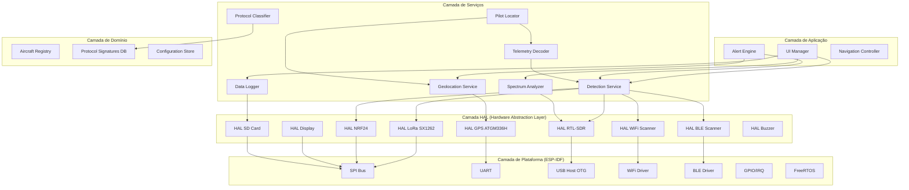
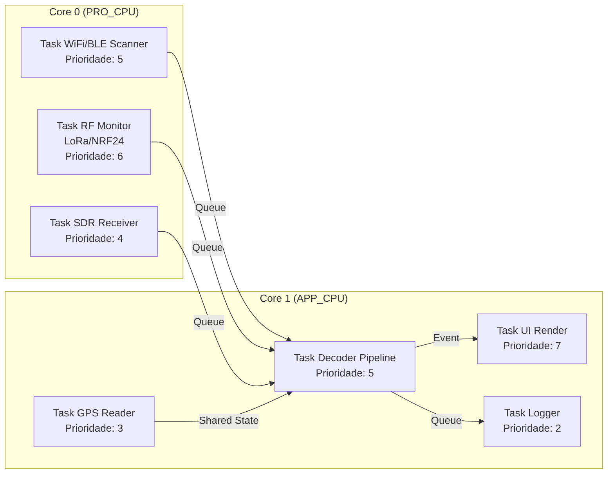
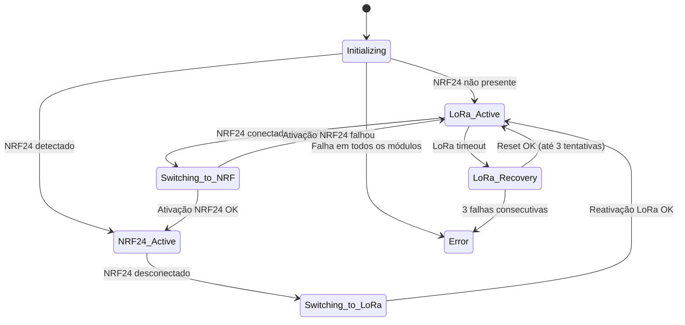
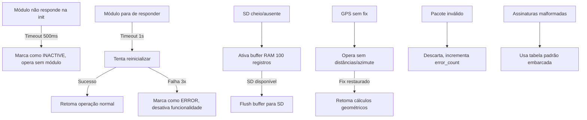

# Design Document

## Overview

Este documento descreve o design técnico do firmware **drone-telemetry-monitor** para a plataforma M5 Stack Cardputer ADV (ESP32-S3FN8). O sistema realiza monitoramento passivo e análise de telemetria de drones em tempo real, utilizando múltiplos módulos de RF e GPS para detecção, classificação e rastreamento de aeronaves não tripuladas.

### Decisões de Plataforma

- **Microcontrolador**: ESP32-S3FN8 (dual-core Xtensa LX7 @ 240 MHz, 8 MB Flash, PSRAM externo via módulo StampS3A)
- **Framework**: ESP-IDF v5.x (C/C++) — escolhido pela API nativa completa para WiFi, BLE, SPI, USB Host e RTOS (FreeRTOS)
- **Display**: ST7789V2 1.14" (240×135 px) via SPI
- **Armazenamento**: microSD via interface SDMMC/SPI
- **Hardware RF**:
  - LoRa SX1262 (M5Stack Cap LoRa) — SPI, recepção 862–928 MHz
  - NRF24L01+ — SPI, varredura 2.4 GHz (2400–2525 MHz)
  - RTL-SDR V3c — USB Host OTG, recepção 24–1766 MHz
- **GPS**: ATGM 336H — UART, posicionamento do dispositivo monitor

### Princípios Arquiteturais

1. **Modularidade de Hardware**: Camada de abstração de hardware (HAL) isolando drivers de módulos RF/GPS da lógica de aplicação
2. **Hot-swap de Módulos**: NRF24 e LoRa são mutuamente exclusivos no barramento SPI; o sistema detecta conexão/desconexão em runtime
3. **Processamento em Pipeline**: Dados fluem de recepção → decodificação → classificação → apresentação com buffers intermediários
4. **Operação Degradada**: Sistema continua funcional mesmo com módulos indisponíveis, desabilitando funcionalidades dependentes
5. **Baixa Latência de UI**: Thread dedicada para interface com prioridade sobre processamento batch

## Architecture

### Diagrama de Camadas



### Modelo de Concorrência (Tasks FreeRTOS)



### Alocação de Barramentos

| Barramento | Periférico | GPIOs (Cardputer ADV EXT 14-pin) |
|------------|-----------|----------------------------------|
| SPI2 (HSPI) | Display ST7789V2 | CLK, MOSI, CS_DISP, DC, RST |
| SPI3 (VSPI) | LoRa SX1262 / NRF24 (exclusivos) + SD Card | CLK, MOSI, MISO, CS_LORA, CS_NRF, CS_SD |
| UART1 | GPS ATGM 336H | TX, RX (9600 baud padrão) |
| USB OTG | RTL-SDR V3c | D+, D- (via conector USB-C host) |
| I2S/I2C | Buzzer (via NS4150B amplifier) | — integrado |

## Components and Interfaces

### HAL (Hardware Abstraction Layer)

Cada módulo de hardware possui uma interface HAL padronizada que expõe operações de alto nível:

```c
// hal_common.h — Interface base para todos os módulos
typedef enum {
    HAL_STATUS_INACTIVE = 0,
    HAL_STATUS_ACTIVE,
    HAL_STATUS_ERROR,
    HAL_STATUS_INITIALIZING
} hal_status_t;

typedef struct {
    hal_status_t status;
    uint32_t last_activity_ms;
    uint32_t error_count;
} hal_module_state_t;

// Interface genérica para módulos RF
typedef struct {
    esp_err_t (*init)(void *config);
    esp_err_t (*deinit)(void);
    esp_err_t (*start_scan)(void *scan_params);
    esp_err_t (*stop_scan)(void);
    hal_status_t (*get_status)(void);
    esp_err_t (*reset)(void);
} hal_rf_interface_t;
```

#### HAL LoRa SX1262

```c
// hal_lora.h
typedef struct {
    uint32_t frequency_hz;      // Frequência central (862–928 MHz)
    uint8_t spreading_factor;   // SF6–SF12
    uint32_t bandwidth_hz;      // 125/250/500 kHz
    uint8_t coding_rate;        // 4/5 a 4/8
    int8_t tx_power_dbm;        // -9 a +22 dBm (não usado em RX)
} lora_config_t;

typedef struct {
    uint8_t *payload;
    uint16_t payload_len;
    int16_t rssi_dbm;
    int8_t snr_db;
    uint32_t frequency_hz;
    uint32_t timestamp_ms;
} lora_packet_t;

esp_err_t hal_lora_init(const lora_config_t *config);
esp_err_t hal_lora_set_frequency(uint32_t freq_hz);
esp_err_t hal_lora_start_rx(void);
esp_err_t hal_lora_get_packet(lora_packet_t *packet, uint32_t timeout_ms);
hal_status_t hal_lora_get_status(void);
esp_err_t hal_lora_deinit(void);
```

#### HAL NRF24

```c
// hal_nrf24.h
typedef struct {
    uint8_t channel;            // 0–125 (2400 + channel MHz)
    uint8_t data_rate;          // 0=1Mbps, 1=2Mbps, 2=250kbps
    uint8_t address_width;      // 3–5 bytes
} nrf24_config_t;

typedef struct {
    uint8_t channel;
    uint8_t rssi_level;         // 0 ou 1 (NRF24 CD register limitado)
    uint8_t *payload;
    uint8_t payload_len;
    uint32_t timestamp_ms;
} nrf24_packet_t;

typedef struct {
    uint8_t channel_energy[126]; // Nível de energia por canal (0–255)
    uint32_t scan_duration_ms;
} nrf24_spectrum_t;

esp_err_t hal_nrf24_init(const nrf24_config_t *config);
esp_err_t hal_nrf24_scan_spectrum(nrf24_spectrum_t *result);
esp_err_t hal_nrf24_listen_channel(uint8_t channel, nrf24_packet_t *packet, uint32_t timeout_ms);
bool hal_nrf24_is_present(void);
hal_status_t hal_nrf24_get_status(void);
esp_err_t hal_nrf24_deinit(void);
```

#### HAL RTL-SDR

```c
// hal_sdr.h
typedef struct {
    uint32_t center_freq_hz;    // 24 MHz – 1766 MHz
    uint32_t sample_rate_hz;    // Máximo 2.4 MHz
    uint8_t gain_index;         // 0–29 (mapeado para valores reais 0.0–49.6 dB)
    bool agc_enabled;
} sdr_config_t;

typedef struct {
    int8_t *iq_samples;         // Buffer I/Q interleaved (8-bit signed)
    uint32_t num_samples;
    uint32_t center_freq_hz;
    uint32_t timestamp_ms;
} sdr_iq_buffer_t;

typedef struct {
    float *power_db;            // Array de potência em dB por bin
    uint32_t num_bins;
    uint32_t freq_start_hz;
    uint32_t freq_step_hz;
} sdr_spectrum_t;

esp_err_t hal_sdr_init(const sdr_config_t *config);
esp_err_t hal_sdr_set_frequency(uint32_t freq_hz);
esp_err_t hal_sdr_set_sample_rate(uint32_t rate_hz);
esp_err_t hal_sdr_read_iq(sdr_iq_buffer_t *buffer, uint32_t timeout_ms);
esp_err_t hal_sdr_compute_spectrum(const sdr_iq_buffer_t *iq, sdr_spectrum_t *spectrum);
hal_status_t hal_sdr_get_status(void);
esp_err_t hal_sdr_deinit(void);
```

#### HAL GPS

```c
// hal_gps.h
typedef struct {
    double latitude;            // Graus decimais (-90 a +90)
    double longitude;           // Graus decimais (-180 a +180)
    float altitude_m;           // Metros acima do nível do mar
    float hdop;                 // Diluição de precisão horizontal
    uint8_t satellites_used;
    uint32_t timestamp_utc_ms;  // Millisegundos desde epoch
    bool fix_valid;             // true se fix_type >= 3D e sats >= 4 e hdop < 5.0
} gps_position_t;

esp_err_t hal_gps_init(uint32_t baud_rate);
esp_err_t hal_gps_get_position(gps_position_t *pos);
bool hal_gps_has_fix(void);
hal_status_t hal_gps_get_status(void);
esp_err_t hal_gps_deinit(void);
```

### Serviços de Aplicação

#### Detection Service

Orquestra todos os módulos de detecção (WiFi, BLE, LoRa, NRF24, SDR) e unifica pacotes recebidos em um formato intermediário antes do pipeline de decodificação.

```c
// detection_service.h
typedef enum {
    DETECTION_SOURCE_WIFI_RID,
    DETECTION_SOURCE_BLE_RID,
    DETECTION_SOURCE_LORA,
    DETECTION_SOURCE_NRF24,
    DETECTION_SOURCE_SDR
} detection_source_t;

typedef struct {
    detection_source_t source;
    uint8_t raw_payload[256];
    uint16_t payload_len;
    int16_t rssi_dbm;
    int8_t snr_db;
    uint32_t frequency_hz;
    uint64_t timestamp_utc_ms;
    gps_position_t monitor_position;
} raw_detection_t;

esp_err_t detection_service_init(void);
esp_err_t detection_service_start(void);
esp_err_t detection_service_stop(void);
```

#### Telemetry Decoder

Recebe detecções brutas e decodifica conforme o protocolo identificado.

```c
// telemetry_decoder.h
typedef struct {
    char uas_id[21];            // RemoteID UAS ID (max 20 chars + null)
    double lat;
    double lon;
    float altitude_m;
    float speed_ms;
    float heading_deg;
    float battery_pct;          // 0–100 ou NaN se indisponível
    float battery_voltage;      // Volts ou NaN
    uint8_t flight_mode;
    uint8_t link_quality_pct;
    int16_t rssi_dbm;
    bool has_position;
    bool has_altitude;
    bool has_speed;
    bool has_battery;
    bool has_flight_mode;
} decoded_telemetry_t;

typedef esp_err_t (*telemetry_decode_fn)(const raw_detection_t *raw, decoded_telemetry_t *out);

esp_err_t telemetry_decoder_init(void);
esp_err_t telemetry_decode(const raw_detection_t *raw, decoded_telemetry_t *out);
```

#### Protocol Classifier

Classifica o protocolo de comunicação com base em assinaturas de pacote.

```c
// protocol_classifier.h
typedef enum {
    PROTOCOL_ELRS = 0,
    PROTOCOL_DJI,
    PROTOCOL_WIFI,
    PROTOCOL_MAVLINK,
    PROTOCOL_CROSSFIRE,
    PROTOCOL_FRSKY,
    PROTOCOL_REMOTEID,
    PROTOCOL_UNKNOWN
} protocol_type_t;

typedef enum {
    CONFIDENCE_HIGH = 0,
    CONFIDENCE_LOW
} confidence_level_t;

typedef struct {
    protocol_type_t protocol;
    confidence_level_t confidence;
    uint32_t frequency_hz;
    char modulation_info[32];
} classification_result_t;

typedef struct {
    protocol_type_t protocol;
    uint8_t header_pattern[16];
    uint8_t header_mask[16];
    uint8_t header_len;
    uint32_t freq_min_hz;
    uint32_t freq_max_hz;
    char modulation[16];
} protocol_signature_t;

esp_err_t classifier_init(const char *signatures_file_path);
esp_err_t classifier_classify(const raw_detection_t *raw, classification_result_t *result);
uint16_t classifier_get_signature_count(void);
```

#### Geolocation Service

Gerencia posição do monitor e calcula geometria relativa a aeronaves e pilotos.

```c
// geolocation_service.h
typedef struct {
    float distance_m;
    float azimuth_deg;          // 0–359°
    bool valid;
} relative_position_t;

esp_err_t geo_service_init(void);
esp_err_t geo_calculate_relative(const gps_position_t *from, double to_lat, double to_lon, relative_position_t *result);
const gps_position_t* geo_get_monitor_position(void);
bool geo_has_valid_fix(void);
```

#### Pilot Locator

Determina a posição do piloto remoto a partir de múltiplas fontes.

```c
// pilot_locator.h
typedef enum {
    PILOT_CONFIDENCE_CONFIRMED = 0, // Fonte: RemoteID Operator Location
    PILOT_CONFIDENCE_ESTIMATED,     // Fonte: Home Point ou triangulação RSSI
    PILOT_CONFIDENCE_UNKNOWN        // Sem dados disponíveis
} pilot_confidence_t;

typedef struct {
    double lat;
    double lon;
    pilot_confidence_t confidence;
    relative_position_t relative_to_monitor;
    bool position_available;
} pilot_position_t;

esp_err_t pilot_locator_update(const char *aircraft_id, const decoded_telemetry_t *telemetry, const raw_detection_t *detection);
esp_err_t pilot_locator_get_position(const char *aircraft_id, pilot_position_t *result);
```

### Máquina de Estados do Hardware Manager



## Data Models

### Aircraft Registry (Registro de Aeronaves)

```c
// aircraft_registry.h
#define MAX_AIRCRAFT 32
#define AIRCRAFT_ID_MAX_LEN 21
#define TELEMETRY_HISTORY_LEN 16

typedef enum {
    AIRCRAFT_STATUS_ACTIVE = 0,
    AIRCRAFT_STATUS_OUT_OF_RANGE,   // >30s sem transmissão
} aircraft_status_t;

typedef struct {
    // Identificação
    char id[AIRCRAFT_ID_MAX_LEN];   // UAS ID ou hash de enlace
    protocol_type_t protocol;
    confidence_level_t protocol_confidence;
    aircraft_status_t status;

    // Telemetria mais recente
    decoded_telemetry_t last_telemetry;
    uint64_t last_seen_utc_ms;
    uint64_t first_seen_utc_ms;

    // Posição relativa ao monitor
    relative_position_t relative_pos;

    // Piloto
    pilot_position_t pilot;

    // Sinal
    int16_t last_rssi_dbm;
    uint32_t last_frequency_hz;

    // Histórico para triangulação
    struct {
        int16_t rssi_dbm;
        gps_position_t monitor_pos;
        uint64_t timestamp_ms;
    } rssi_history[TELEMETRY_HISTORY_LEN];
    uint8_t rssi_history_count;

    // Controle
    bool slot_occupied;
} aircraft_entry_t;

typedef struct {
    aircraft_entry_t entries[MAX_AIRCRAFT];
    uint8_t count;
    uint32_t total_detected;        // Total desde inicialização
    uint32_t error_count;           // Pacotes descartados
    SemaphoreHandle_t mutex;
} aircraft_registry_t;

esp_err_t registry_init(aircraft_registry_t *reg);
aircraft_entry_t* registry_find_or_create(aircraft_registry_t *reg, const char *id);
aircraft_entry_t* registry_find(aircraft_registry_t *reg, const char *id);
void registry_update_status(aircraft_registry_t *reg, uint64_t current_time_ms);
uint8_t registry_get_active_count(const aircraft_registry_t *reg);
```

### Formato de Log CSV

```
timestamp_utc,monitor_lat,monitor_lon,monitor_alt,aircraft_id,protocol,rssi_dbm,lat,lon,alt_m,speed_ms,battery_pct,event_type
2024-03-15T10:30:45.123Z,-23.550520,-46.633309,760.5,BRA-UAS-001,REMOTEID,-65,-23.549800,-46.632100,780.2,12.5,85.0,TELEMETRY
2024-03-15T10:30:46.500Z,-23.550520,-46.633309,760.5,ELRS-A1B2C3,ELRS,-72,,,,,90.0,DETECTION
```

### Tabela de Assinaturas de Protocolo (SD Card — signatures.csv)

```
protocol,header_hex,header_mask_hex,header_len,freq_min_mhz,freq_max_mhz,modulation
ELRS,00,FC,1,862,928,LORA
ELRS,00,FC,1,2400,2500,LORA
MAVLINK,FE,,1,0,0,ANY
MAVLINK,FD,,1,0,0,ANY
DJI,55,FF,1,2400,2500,OFDM
CROSSFIRE,C8,FF,1,862,928,LORA
FRSKY,7E,FF,1,2400,2500,FHSS
```

### Configuração de Sistema (SD Card — config.json)

```json
{
  "alert": {
    "sound_enabled": true,
    "proximity_threshold_m": 500,
    "proximity_repeat_interval_s": 10,
    "out_of_range_timeout_s": 30
  },
  "spectrum": {
    "default_center_freq_mhz": 915,
    "default_bandwidth_khz": 500,
    "default_gain_db": 20.0,
    "detection_threshold_dbm": -60
  },
  "logging": {
    "max_file_size_mb": 10,
    "buffer_size_records": 100
  },
  "scan": {
    "remoteid_cycle_ms": 3000,
    "nrf24_dwell_time_ms": 100,
    "lora_dwell_time_ms": 50,
    "module_poll_interval_ms": 500
  },
  "gps": {
    "min_satellites": 4,
    "max_hdop": 5.0,
    "fix_timeout_s": 60,
    "degraded_timeout_s": 5
  }
}
```

### Modelo de Estado da UI

```c
// ui_state.h
typedef enum {
    UI_SCREEN_SCANNER = 0,
    UI_SCREEN_MAP,
    UI_SCREEN_AIRCRAFT_LIST,
    UI_SCREEN_SPECTRUM,
    UI_SCREEN_SETTINGS,
    UI_SCREEN_LOG,
    UI_SCREEN_MAIN_MENU
} ui_screen_t;

typedef struct {
    ui_screen_t current_screen;
    uint8_t scanner_page;           // Página atual (5 itens/página)
    uint8_t selected_aircraft_idx;
    float map_scale_m;              // Escala do mapa em metros
    bool notification_visible;
    char notification_text[64];
    uint32_t notification_expire_ms;

    // Status bar
    hal_status_t module_status[5];  // LoRa, NRF24, SDR, GPS, SD
    uint8_t aircraft_count;
    bool gps_fix_valid;
    bool sd_available;
} ui_state_t;
```


## Correctness Properties

*Uma propriedade é uma característica ou comportamento que deve ser verdadeiro em todas as execuções válidas de um sistema — essencialmente, uma declaração formal sobre o que o sistema deve fazer. Propriedades servem como a ponte entre especificações legíveis por humanos e garantias de corretude verificáveis por máquina.*

### Property 1: Decodificação RemoteID round-trip

*For any* pacote RemoteID válido conforme ASTM F3411 (WiFi NAN/Beacon ou BLE Legacy Advertisement), a decodificação SHALL extrair corretamente o UAS ID, posição (latitude, longitude), altitude, e Operator Location (quando presente), de modo que re-codificar os campos decodificados produza um pacote equivalente ao original nos campos decodificados.

**Validates: Requirements 1.1, 1.2, 6.1**

### Property 2: Rejeição de pacotes RemoteID inválidos

*For any* pacote que falhe em pelo menos um critério de validação ASTM F3411 (CRC inválido, campos obrigatórios ausentes, ou tamanho fora da especificação), a decodificação SHALL retornar erro e o registro SHALL permanecer inalterado (contagem de aeronaves não muda).

**Validates: Requirements 1.4**

### Property 3: Classificação de protocolo contra tabela de assinaturas

*For any* pacote com cabeçalho que corresponda a uma assinatura na tabela (match em header_pattern com header_mask na faixa de frequência correspondente), o classificador SHALL retornar o protocolo correto. Para pacotes cujo cabeçalho não corresponde a nenhuma assinatura, o classificador SHALL retornar PROTOCOL_UNKNOWN.

**Validates: Requirements 7.1, 7.2, 7.6, 2.3, 2.4, 4.3, 4.6, 12.3**

### Property 4: Decodificação de telemetria MAVLink

*For any* pacote MAVLink v1 (STX=0xFE) ou v2 (STX=0xFD) válido contendo mensagens de telemetria (GLOBAL_POSITION_INT, BATTERY_STATUS, HEARTBEAT, HOME_POSITION), a decodificação SHALL extrair os campos numéricos com valores iguais aos codificados no payload, incluindo conversões de unidade corretas (lat/lon de int32 para graus decimais dividindo por 1e7, altitude de mm para metros).

**Validates: Requirements 8.1, 6.2**

### Property 5: Decodificação de telemetria ELRS

*For any* pacote ELRS contendo payload de telemetria CRSF, a decodificação SHALL extrair os campos presentes (RSSI, LQ, bateria, GPS) com valores dentro das faixas válidas do protocolo, e marcar campos ausentes como indisponíveis (has_* = false).

**Validates: Requirements 8.2**

### Property 6: Cálculo de distância e azimute geográfico

*For any* par de coordenadas GPS válidas (latitude ∈ [-90,90], longitude ∈ [-180,180]), o cálculo de posição relativa SHALL produzir: distância ≥ 0, azimute ∈ [0, 360), e a distância de A para B SHALL ser igual à distância de B para A (simetria). Adicionalmente, para pontos idênticos, a distância SHALL ser 0.

**Validates: Requirements 5.3, 6.1, 6.2, 6.3**

### Property 7: Formatação hexadecimal com truncamento

*For any* payload de bytes com tamanho arbitrário, a formatação hexadecimal SHALL produzir uma string com exatamente min(payload_len, 256) × 2 caracteres hexadecimais, e decodificar a string de volta SHALL produzir os primeiros min(payload_len, 256) bytes do payload original.

**Validates: Requirements 3.3, 8.5**

### Property 8: Round-trip da tabela de assinaturas de protocolo

*For any* tabela de assinaturas de protocolo válida (1 a 100 entradas, cada uma com header_pattern, mask, frequências e modulação válidos), serializar para formato CSV e fazer parse de volta SHALL produzir uma tabela equivalente à original.

**Validates: Requirements 7.4**

### Property 9: Resiliência a tabela de assinaturas malformada

*For any* string que não seja um CSV válido conforme o formato esperado (campos ausentes, tipos inválidos, arquivo vazio, encoding corrompido), o parse SHALL retornar erro sem crash e o sistema SHALL utilizar a tabela padrão embarcada.

**Validates: Requirements 7.5**

### Property 10: Validação de fix GPS

*For any* dados GPS com número de satélites e HDOP arbitrários, fix_valid SHALL ser true se e somente se satellites_used ≥ 4 AND hdop < 5.0. Quando fix_valid transiciona de true para false, a última posição válida SHALL ser preservada.

**Validates: Requirements 5.1, 5.5**

### Property 11: Mapeamento de confiança de posição do piloto

*For any* aeronave detectada com fonte de posição do piloto, o nível de confiança SHALL ser: CONFIRMED se a fonte é Operator Location de RemoteID, ESTIMATED se a fonte é Home Point MAVLink ou triangulação RSSI, e UNKNOWN se nenhuma fonte está disponível.

**Validates: Requirements 6.4, 6.5**

### Property 12: Paginação da lista de aeronaves

*For any* lista de N aeronaves ativas (N ≥ 0) com tamanho de página 5, o número de páginas SHALL ser ceil(N/5) quando N > 0 e 0 quando N = 0, cada página SHALL conter no máximo 5 itens, e a união de todas as páginas SHALL conter exatamente as N aeronaves sem duplicatas.

**Validates: Requirements 9.3, 9.7**

### Property 13: Registro CSV round-trip

*For any* entrada de log válida contendo timestamp UTC, posição GPS do monitor, ID de aeronave, protocolo, RSSI e campos de telemetria, serializar para formato CSV e fazer parse de volta SHALL produzir uma entrada equivalente à original (preservando todos os campos).

**Validates: Requirements 11.1, 11.3, 8.4**

### Property 14: Buffer circular RAM com capacidade fixa

*For any* sequência de N registros inseridos no buffer (N > 100), o buffer SHALL conter exatamente 100 registros, e esses SHALL ser os 100 registros mais recentes na ordem de inserção.

**Validates: Requirements 11.4**

### Property 15: Rotação de arquivo de log por tamanho

*For any* sequência de escritas no log com tamanhos variados, quando o tamanho acumulado do arquivo atual excede 10 MB, o sistema SHALL criar um novo arquivo e continuar a escrita nele. O arquivo anterior SHALL ter tamanho ≤ 10 MB + tamanho do último registro.

**Validates: Requirements 11.1**

### Property 16: Alerta de proximidade condicionado a GPS fix

*For any* aeronave detectada com posição conhecida, o alerta de proximidade SHALL ser emitido se e somente se: (a) a distância calculada é inferior ao limiar configurado (padrão 500m), E (b) o GPS do monitor possui fix válido, E (c) alertas sonoros estão habilitados (ou modo silencioso ativa apenas notificação visual).

**Validates: Requirements 13.2, 13.4, 13.5**

### Property 17: Transição de status de aeronave por timeout

*For any* aeronave no registry, quando current_time - last_seen_utc_ms > 30000 ms, o status SHALL ser AIRCRAFT_STATUS_OUT_OF_RANGE. Quando um novo pacote é recebido para uma aeronave com status OUT_OF_RANGE, o status SHALL transicionar para AIRCRAFT_STATUS_ACTIVE.

**Validates: Requirements 13.3, 13.6**

### Property 18: Mecanismo de retry do LoRa com política definida

*For any* sequência de falhas de comunicação com o módulo LoRa, o sistema SHALL tentar reinicializar no máximo 3 vezes com intervalo de 2 segundos entre tentativas. Se a 3ª tentativa falhar, o sistema SHALL desativar o monitoramento LoRa.

**Validates: Requirements 3.5**

### Property 19: Validação de configuração de espectro

*For any* configuração de spectrum analyzer, a frequência central SHALL estar em [24 MHz, 1766 MHz], a largura de banda de resolução em [10 kHz, 1 MHz], e o ganho em [0 dB, 49.6 dB]. Configurações fora desses ranges SHALL ser rejeitadas.

**Validates: Requirements 12.2, 4.4**

### Property 20: Geração KML preserva todas as posições

*For any* sessão contendo N posições de aeronaves e pilotos, o arquivo KML gerado SHALL conter exatamente N placemarks, e cada placemark SHALL conter as coordenadas (latitude, longitude, altitude) correspondentes ao registro original.

**Validates: Requirements 11.2**

### Property 21: Unicidade no Aircraft Registry

*For any* sequência de detecções contendo aeronaves com IDs repetidos, o registry SHALL conter exatamente uma entrada por ID único, e os dados SHALL corresponder à detecção mais recente para cada ID.

**Validates: Requirements 1.1, 1.2, 8.6**

### Property 22: Rollback de máquina de estados no hot-swap

*For any* estado da máquina de estados de hardware onde o LoRa foi desativado para ativar o NRF24, se a ativação do NRF24 falhar, o sistema SHALL retornar ao estado LoRa_Active com o módulo LoRa re-inicializado e operacional.

**Validates: Requirements 10.3**

## Error Handling

### Estratégia de Tratamento de Erros por Camada

| Camada | Estratégia | Ação |
|--------|-----------|------|
| HAL | Retry com backoff, fallback para estado seguro | Retorna `esp_err_t`, incrementa error_count no module_state |
| Serviços | Degradação graciosa, continua com módulos disponíveis | Log do erro, atualiza status na UI, continua operação |
| UI | Exibe indicadores visuais claros ao operador | Notificações, ícones de status, mensagens de erro |
| Dados | Buffer em RAM quando SD indisponível, flush quando disponível | Buffer circular de 100 registros |

### Cenários de Erro e Recuperação



### Códigos de Erro Customizados

```c
// error_codes.h
#define ERR_HAL_BASE            0x1000
#define ERR_HAL_LORA_TIMEOUT    (ERR_HAL_BASE + 0x01)
#define ERR_HAL_LORA_SPI_FAIL   (ERR_HAL_BASE + 0x02)
#define ERR_HAL_NRF_TIMEOUT     (ERR_HAL_BASE + 0x10)
#define ERR_HAL_NRF_SPI_FAIL    (ERR_HAL_BASE + 0x11)
#define ERR_HAL_SDR_USB_FAIL    (ERR_HAL_BASE + 0x20)
#define ERR_HAL_SDR_NO_DEVICE   (ERR_HAL_BASE + 0x21)
#define ERR_HAL_GPS_NO_FIX      (ERR_HAL_BASE + 0x30)
#define ERR_HAL_GPS_DEGRADED    (ERR_HAL_BASE + 0x31)
#define ERR_HAL_SD_FULL         (ERR_HAL_BASE + 0x40)
#define ERR_HAL_SD_ABSENT       (ERR_HAL_BASE + 0x41)

#define ERR_DECODE_BASE         0x2000
#define ERR_DECODE_CRC_FAIL     (ERR_DECODE_BASE + 0x01)
#define ERR_DECODE_INCOMPLETE   (ERR_DECODE_BASE + 0x02)
#define ERR_DECODE_UNKNOWN_FMT  (ERR_DECODE_BASE + 0x03)

#define ERR_CONFIG_BASE         0x3000
#define ERR_CONFIG_PARSE_FAIL   (ERR_CONFIG_BASE + 0x01)
#define ERR_CONFIG_FILE_ABSENT  (ERR_CONFIG_BASE + 0x02)
```

### Limites de Recursos

| Recurso | Limite | Ação quando excedido |
|---------|--------|---------------------|
| Aircraft Registry | 32 entradas | Substitui entrada mais antiga com status OUT_OF_RANGE |
| RAM buffer (SD ausente) | 100 registros | Ring buffer — sobrescreve mais antigo |
| Arquivo de log | 10 MB | Rotação para novo arquivo |
| Queue de pacotes (RF→Decoder) | 64 itens | Drop silencioso de pacotes mais antigos |
| Stack de tasks FreeRTOS | 4096–8192 bytes por task | Monitor de stack overflow via `uxTaskGetStackHighWaterMark` |

## Testing Strategy

### Abordagem Dual de Testes

O firmware utiliza uma abordagem complementar de testes unitários (exemplos específicos) e testes baseados em propriedades (verificação universal):

#### Testes Baseados em Propriedades (PBT)

- **Biblioteca**: [Theft](https://github.com/silentbicycle/theft) — biblioteca PBT em C para embedded, ou alternativamente [Unity + custom generators](https://www.throwtheswitch.org/unity) com geradores manuais para ESP-IDF
- **Mínimo 100 iterações** por teste de propriedade
- **Execução em host** (x86/x64) usando mocks da HAL para velocidade — sem dependência de hardware real para PBT
- **Tag format**: `/* Feature: drone-telemetry-monitor, Property N: <texto> */`
- Cada propriedade do design (1–22) corresponde a um único teste PBT
- Geradores customizados para:
  - Pacotes RemoteID válidos e inválidos (conforme ASTM F3411)
  - Pacotes MAVLink v1/v2 com mensagens variadas
  - Pacotes ELRS com campos opcionais
  - Coordenadas GPS em ranges válidos
  - Tabelas de assinaturas de protocolo
  - Sequências de eventos temporais

#### Testes Unitários (Exemplos e Edge Cases)

- **Framework**: [Unity](https://www.throwtheswitch.org/unity) (padrão para ESP-IDF)
- Foco em:
  - Exemplos concretos de decodificação com pacotes reais capturados
  - Edge cases de hardware (timeout, desconexão)
  - Sequências de inicialização
  - Integrações entre componentes

#### Testes de Integração

- **Executados no hardware real** (M5 Cardputer ADV)
- Foco em:
  - Latências de UI (≤200ms para input, ≤500ms para atualização)
  - Ciclos de varredura (RemoteID ≤3s, NRF24 ≤100ms/canal, LoRa ≤50ms/freq)
  - Hot-swap de módulos (≤2s de transição)
  - Performance de escrita em SD Card

### Estrutura de Diretórios de Testes

```
test/
├── host/                    # Testes executáveis em x86 (PBT + Unit)
│   ├── test_remoteid_decoder.c
│   ├── test_mavlink_decoder.c
│   ├── test_elrs_decoder.c
│   ├── test_protocol_classifier.c
│   ├── test_geolocation.c
│   ├── test_pilot_locator.c
│   ├── test_aircraft_registry.c
│   ├── test_log_serialization.c
│   ├── test_kml_export.c
│   ├── test_buffer_circular.c
│   ├── test_pagination.c
│   ├── test_config_parser.c
│   ├── test_alert_engine.c
│   ├── test_hw_state_machine.c
│   └── generators/          # Geradores para PBT
│       ├── gen_remoteid.c
│       ├── gen_mavlink.c
│       ├── gen_elrs.c
│       ├── gen_gps.c
│       └── gen_protocol_signatures.c
├── target/                  # Testes no hardware real
│   ├── test_hal_lora.c
│   ├── test_hal_nrf24.c
│   ├── test_hal_sdr.c
│   ├── test_hal_gps.c
│   ├── test_ui_latency.c
│   └── test_sd_performance.c
└── mocks/                   # Mocks da HAL para testes host
    ├── mock_hal_lora.c
    ├── mock_hal_nrf24.c
    ├── mock_hal_sdr.c
    ├── mock_hal_gps.c
    └── mock_hal_sd.c
```

### Mapa de Propriedades para Testes

| Propriedade | Arquivo de Teste | Gerador |
|-------------|-----------------|---------|
| 1 (RemoteID round-trip) | test_remoteid_decoder.c | gen_remoteid.c |
| 2 (RemoteID rejeição) | test_remoteid_decoder.c | gen_remoteid.c (mutações) |
| 3 (Classificação protocolo) | test_protocol_classifier.c | gen_protocol_signatures.c |
| 4 (MAVLink decode) | test_mavlink_decoder.c | gen_mavlink.c |
| 5 (ELRS decode) | test_elrs_decoder.c | gen_elrs.c |
| 6 (Distância/azimute) | test_geolocation.c | gen_gps.c |
| 7 (Hex truncamento) | test_log_serialization.c | — (bytes aleatórios) |
| 8 (Assinaturas round-trip) | test_config_parser.c | gen_protocol_signatures.c |
| 9 (Assinaturas malformadas) | test_config_parser.c | — (strings aleatórias) |
| 10 (GPS fix validation) | test_geolocation.c | gen_gps.c |
| 11 (Confiança piloto) | test_pilot_locator.c | gen_remoteid.c + gen_mavlink.c |
| 12 (Paginação) | test_pagination.c | — (listas de tamanhos variados) |
| 13 (CSV round-trip) | test_log_serialization.c | gen_gps.c + gen_mavlink.c |
| 14 (Buffer circular) | test_buffer_circular.c | — (sequências de registros) |
| 15 (Rotação arquivo) | test_log_serialization.c | — (escritas de tamanhos variados) |
| 16 (Alerta proximidade) | test_alert_engine.c | gen_gps.c |
| 17 (Timeout status) | test_aircraft_registry.c | — (timestamps variados) |
| 18 (Retry LoRa) | test_hw_state_machine.c | — (sequências de falha/sucesso) |
| 19 (Config espectro) | test_config_parser.c | — (valores em ranges) |
| 20 (KML export) | test_kml_export.c | gen_gps.c |
| 21 (Unicidade registry) | test_aircraft_registry.c | gen_remoteid.c |
| 22 (Rollback hot-swap) | test_hw_state_machine.c | — (cenários de falha) |
