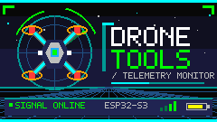

<p align="center">
  
</p>

# 🛩️ Drone Telemetry Monitor

Real-time passive drone detection and telemetry analysis firmware for the **M5 Stack Cardputer ADV** (ESP32-S3). Intercepts, decodes, and displays drone communications across multiple RF bands — all from a pocket-sized device.


---

## ✨ Features

- **RemoteID Decoding** — WiFi NAN/Beacon and BLE advertisement scanning per ASTM F3411
- **ELRS Telemetry** — Intercept ExpressLRS packets on 900 MHz (LoRa) and 2.4 GHz (NRF24)
- **MAVLink Decoding** — Full v1/v2 telemetry extraction (position, altitude, speed, battery, flight mode)
- **DJI Detection** — Identify OcuSync/O3 links with frequency and signal strength logging
- **Spectrum Analyzer** — Real-time waterfall display across 24–1766 MHz via RTL-SDR
- **Pilot Localization** — Estimate pilot position via RemoteID operator location, MAVLink home point, or RSSI triangulation
- **Protocol Classification** — Auto-identify ELRS, DJI, WiFi, MAVLink, Crossfire, FrSky from packet signatures
- **2D Map View** — Positional display of aircraft, pilots, and your own location with adjustable zoom
- **Proximity Alerts** — Audio/visual notifications when drones enter a configurable radius
- **Data Logging** — CSV + KML export to microSD with automatic file rotation at 10 MB
- **Hot-Swap Modules** — Automatic LoRa ↔ NRF24 switching when hardware is connected/disconnected

---

## 🔧 Hardware

### Base Platform

| Component | Details |
|-----------|---------|
| **Board** | M5 Stack Cardputer ADV |
| **MCU** | ESP32-S3FN8 (dual-core Xtensa LX7 @ 240 MHz) |
| **Flash** | 8 MB (QIO) |
| **PSRAM** | External, Octal SPI @ 80 MHz |
| **Display** | ST7789V2 1.14" LCD (240×135 px, RGB565) |
| **Input** | Built-in keyboard |
| **Audio** | NS4150B buzzer |

### RF Modules

| Module | Interface | Band | Purpose |
|--------|-----------|------|---------|
| **LoRa SX1262** (M5Stack Cap LoRa) | SPI | 862–928 MHz | ELRS 900 / LoRa monitoring |
| **NRF24L01+** | SPI | 2400–2525 MHz | ELRS 2.4 GHz / DJI / WiFi detection |
| **RTL-SDR V3c** | USB Host OTG | 24–1766 MHz | Broadband spectrum analysis |
| **GPS ATGM 336H** | UART | — | Monitor geolocation |

> **Note:** LoRa and NRF24 share the SPI3 bus and are mutually exclusive — the firmware handles switching automatically.

### Storage

- **microSD** (SPI/SDMMC) — Data logging, config files, KML export

---

## 🏗️ Architecture

The firmware follows a layered architecture with clean separation of concerns:

```
┌──────────────────────────────────────────────┐
│             UI Layer (screens)               │
│  Scanner · Map · Spectrum · Settings · Log   │
├──────────────────────────────────────────────┤
│            Services Layer                    │
│  Detection · Telemetry · Protocol Classifier │
│  Geolocation · Pilot Locator · Alerts        │
│  Spectrum Analyzer · Data Logger             │
├──────────────────────────────────────────────┤
│             Domain Layer                     │
│  Aircraft Registry · Protocol Signatures DB  │
│  Configuration Store                         │
├──────────────────────────────────────────────┤
│        HAL (Hardware Abstraction)            │
│  LoRa · NRF24 · SDR · GPS · WiFi · BLE      │
│  Display · SD Card · Buzzer · HW Manager     │
├──────────────────────────────────────────────┤
│         ESP-IDF / FreeRTOS Platform          │
│  SPI · UART · USB Host · WiFi · BLE · GPIO  │
└──────────────────────────────────────────────┘
```

### Concurrency Model

Tasks are distributed across the ESP32-S3's dual cores:

| Core | Task | Priority |
|------|------|----------|
| Core 0 (PRO) | WiFi/BLE Scanner | 5 |
| Core 0 (PRO) | RF Monitor (LoRa/NRF24) | 6 |
| Core 0 (PRO) | SDR Receiver | 4 |
| Core 1 (APP) | UI Render | 7 |
| Core 1 (APP) | Decoder Pipeline | 5 |
| Core 1 (APP) | GPS Reader | 3 |
| Core 1 (APP) | Data Logger | 2 |

---

## 📂 Project Structure

```
drone-telemetry-monitor/
├── CMakeLists.txt              # Top-level ESP-IDF project config
├── sdkconfig.defaults          # Default SDK configuration for ESP32-S3
├── partitions.csv              # Custom partition table (3 MB app + 5 MB FAT)
├── components/
│   ├── common/                 # Shared types, error codes, HAL base types
│   ├── hw_hal/                 # Hardware abstraction layer
│   │   ├── include/            #   HAL headers (lora, nrf24, sdr, gps, display, etc.)
│   │   └── src/                #   HAL implementations + HW Manager state machine
│   ├── domain/                 # Business logic and data models
│   │   ├── include/            #   Aircraft registry, protocol signatures, config store
│   │   └── src/
│   ├── services/               # Application services
│   │   ├── include/            #   Detection, decoding, classification, geolocation, etc.
│   │   └── src/
│   └── ui/                     # Display screens and navigation
│       ├── include/            #   UI manager + screen headers
│       └── src/
├── main/                       # Application entry point
├── test/
│   ├── host/                   # Host-side tests (Unity + Theft PBT, x86)
│   └── mocks/                  # HAL mock implementations for testing
└── .github/workflows/          # CI/CD (build + auto-release)
```

---

## 🚀 Getting Started

### Prerequisites

- [ESP-IDF v5.3+](https://docs.espressif.com/projects/esp-idf/en/latest/esp32s3/get-started/)
- USB-C cable for flashing
- M5 Stack Cardputer ADV hardware

### Build

```bash
# Set up ESP-IDF environment
. $IDF_PATH/export.sh

# Set target to ESP32-S3
idf.py set-target esp32s3

# Build the firmware
idf.py build
```

### Flash

```bash
# Flash to device (adjust port as needed)
idf.py -p /dev/ttyACM0 flash

# Monitor serial output
idf.py -p /dev/ttyACM0 monitor
```

### Configuration

The firmware loads configuration from a `config.json` file on the microSD card. If the file is missing or malformed, sensible defaults are used.

Configurable parameters include:
- Spectrum analyzer settings (center frequency, bandwidth, gain, detection threshold)
- Alert thresholds (proximity distance, repeat interval, silent mode)
- Protocol signature table (updatable without reflashing)
- LoRa/NRF24 scan parameters

---

## 🧪 Testing

Tests run on the host machine (x86) using mocked HAL interfaces:

```bash
# Configure host tests in a fresh build directory
cmake -S test/host -B build/host

# Build host tests
cmake --build build/host

# Run all tests via CTest
ctest --test-dir build/host --output-on-failure
```

**Frameworks:**
- [Unity](http://www.throwtheswitch.org/unity) — Unit testing for C
- [Theft](https://github.com/silentbicycle/theft) — Property-based testing (minimum 100 iterations per property)

---

## 🔄 CI/CD

The project uses GitHub Actions with the `espressif/idf:v5.3` Docker image:

- **On every push/PR to `main`:** builds the firmware and uploads artifacts
- **On merge to `main`:** automatically creates a tagged release with firmware binaries

Release artifacts include:
- `drone-telemetry-monitor.bin` (application)
- `bootloader.bin`
- `partition-table.bin`
- `flasher_args.json`

---

## 📡 Supported Protocols

| Protocol | Detection Method | Decoded Data |
|----------|-----------------|--------------|
| **RemoteID** | WiFi + BLE beacons | UAS ID, position, altitude, operator location |
| **ELRS** | LoRa (900 MHz) / NRF24 (2.4 GHz) | RSSI, LQ, battery, GPS |
| **MAVLink v1/v2** | SDR / LoRa | Position, altitude, speed, battery, flight mode, home point |
| **DJI (OcuSync/O3)** | NRF24 / SDR | Frequency, RSSI, classification |
| **Crossfire** | SDR | Frequency, signal characteristics |
| **FrSky** | SDR | Frequency, signal characteristics |

---

## 🖥️ UI Screens

| Screen | Description |
|--------|-------------|
| **Main Menu** | Navigation hub for all features |
| **Scanner** | Paginated list of detected aircraft (RSSI, protocol, distance, bearing) |
| **Map** | 2D positional view with aircraft, pilots, and monitor icons |
| **Spectrum** | Real-time waterfall with protocol frequency markers |
| **Settings** | Configure frequencies, alerts, display, and modules |
| **Log** | View recent events and trigger KML/CSV export |

---

## 📋 Memory Layout

| Partition | Type | Offset | Size |
|-----------|------|--------|------|
| NVS | data/nvs | 0x9000 | 24 KB |
| PHY Init | data/phy | 0xF000 | 4 KB |
| Factory App | app/factory | 0x10000 | 3 MB |
| Storage (FAT) | data/fat | 0x310000 | ~5 MB |

---

## 🤝 Contributing

1. Fork the repository
2. Create a feature branch (`git checkout -b feature/my-feature`)
3. Build and test locally
4. Submit a Pull Request targeting `main`

---

## 📝 Notes

- The firmware operates in **passive monitoring mode only** — it does not transmit RF signals
- All detected data is stored locally; no network connectivity is required for operation
- Protocol signature tables can be updated via SD card without reflashing
- The system continues operating in degraded mode when optional hardware modules are unavailable
